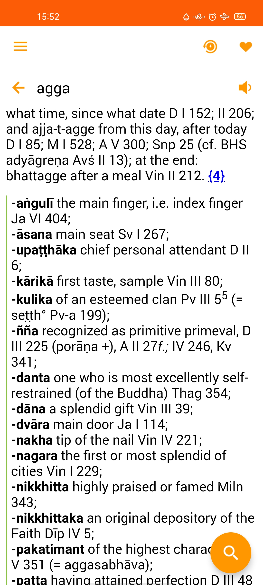

[TOC]

## A digital Version of The PTS Pali-English Dictionary (proofread 2021)

A modified digital version of The Pali Text Society's Pāli-English Dictionary in Stardict dictionary format files. All word definitions are in English as of the Pāḷi Roman PTS PED, *only the words to be looked up are in various pāḷi scripts*.  There are **17 files of them for 17 pāḷi scripts**, choose your preferred one in the [download](#download) session below. 

## Quick Info

Converted to Stardict format files from a HTML source file released by [Buddhadust](http://buddhadust.net).

With  modifications, see **Change log** below.


> Introduction from Buddhadust for the work:
> 
> This work is based on an scanned version of an early reprint of an early edition of The Pali Text Society's Pali English Dictionary revised in accordance with the 2015 "Reprint with corrections" by K.R. Norman, William Pruitt and Peter Jackson.

For more info, pls visit [Buddhadust.](http://buddhadust.net)

This 2021 proofread Buddhadust -  PTS PED digital version is currently supposed to be "the most error-free" among those found on the Internet. It is said that somebody had spent thousands of hours to perform proofread for this version shared by Buddhadust. So we should say sādhu sādhu sādhu to their efforts.

> + Credits belong to PTS & Buddhadust's efforts. 
>
> + To convert pāḷi Roman to other scripts, we used a script converter developed by Janaka ([tipitaka.app](https://tipitaka.app)) used with its author consent in 2020.
>     

## Change log: 
**Oct 2021**: 



+ Added inline CSS for word suffix & Vethuis scheme. It means for all dictionaries, you can also look up a pali word using its Vethuis scheme form, or the pali word in Roman script. For example with aṃsa:

    + In Roman pali, you have 2 ways of input
    aṃsa|a.msa
    
    + In all other scripts, you have 3 ways of input
    අංස|aṃsa|a.msa

+ Fixed non-word chars (\W) in some word entries.  And to make it more usable in dictionary apps, some entries with '-' are duplicated into two entries.
    For example, ati-ambila will have two entries:
    
    > ati-ambila  to sour
    
    > atiambila  to sour 
    
+ This Vethuis scheme:
Here we use _n => ṅ and _m => ṁ
So they can be used smoothly in dictionary app **href bword://**.


```

        aa ā
        ii ī
        uu ū
        _n ṅ
        ~n ñ
        .n ṇ
        .m ṃ
        _m ṁ
        .d ḍ
        .t ṭ
        .l ḷ
        .r ṛ
        .s ṣ
```

**March 2021**: initial release


## License

This derived work follows the license stated in the source file:

```bash

Corrected reprint © The Pali Text Society
Commercial Rights Reserved
Creative Commons Licence by-nc/3.0/

Converted to Stardict format files from a HTML source file released by [Buddhadust](http://buddhadust.net)

```

## Download


All definitions are in English as of the Pāḷi Roman PTS PED, *only the **words** to be looked up are in your selected scripts*. There are **17 files of them for 17 pāḷi scripts**, find your preferred one. 

Note: `Easy copy links` are listed to let one copy the download links conveniently on their touch screen devices (see [1. iPhone/iPad/iPod](#1-iphoneipadipod) session below). They have the **same** content with the HTML download links. One **doesn't need** to download a link twice!

**Stardict dictionary data**

1. Pāḷi **Roman** (~2.4M) [PTSPED-2021.zip](https://vpnry.github.io/ptsped/stardict/PTSPED-2021.zip)
   Easy copy link:   `https://vpnry.github.io/ptsped/stardict/PTSPED-2021.zip` 


2. Pāḷi Bengali - **বাংলা** (~2.5M) [Bengali-PTSPED-2021.zip](https://vpnry.github.io/ptsped/stardict/Bengali-PTSPED-2021.zip)
   Easy copy link:   `https://vpnry.github.io/ptsped/stardict/PTSPED-2021.zip`


3. Pāḷi Brahmi - **Brāhmī** (~2.5M) [Brahmi-PTSPED-2021.zip](https://vpnry.github.io/ptsped/stardict/Brahmi-PTSPED-2021.zip)
    Easy copy link:   `https://vpnry.github.io/ptsped/stardict/Brahmi-PTSPED-2021.zip`


4. Pāḷi Cyrillic - **кириллица** (~2.5M) [Cyrillic-PTSPED-2021.zip](https://vpnry.github.io/ptsped/stardict/Cyrillic-PTSPED-2021.zip)
    Easy copy link:   `https://vpnry.github.io/ptsped/stardict/Cyrillic-PTSPED-2021.zip`


5. Pāḷi Devanagari - **हिन्दी** (~2.5M) [Devanagari-PTSPED-2021.zip](https://vpnry.github.io/ptsped/stardict/Devanagari-PTSPED-2021.zip)
    Easy copy link:   `https://vpnry.github.io/ptsped/stardict/Devanagari-PTSPED-2021.zip`


6. Pāḷi Gujarati - **ગુજરાતી** (~2.5M) [Gujarati-PTSPED-2021.zip](https://vpnry.github.io/ptsped/stardict/Gujarati-PTSPED-2021.zip)
    Easy copy link:   `https://vpnry.github.io/ptsped/stardict/Gujarati-PTSPED-2021.zip`


7. Pāḷi Gurmukhi - **ਗੁਰਮੁਖੀ** (~2.5M) [Gurmukhi-PTSPED-2021.zip](https://vpnry.github.io/ptsped/stardict/Gurmukhi-PTSPED-2021.zip)
    Easy copy link:   `https://vpnry.github.io/ptsped/stardict/Gurmukhi-PTSPED-2021.zip`


8. Pāḷi Kannada - **ಕನ್ನಡ** (~2.5M) [Kannada-PTSPED-2021.zip](https://vpnry.github.io/ptsped/stardict/Kannada-PTSPED-2021.zip)
    Easy copy link:   `https://vpnry.github.io/ptsped/stardict/Kannada-PTSPED-2021.zip`


9. Pāḷi Khmer - **ភាសាខ្មែរ** (~2.5M) [Khmer-PTSPED-2021.zip](https://vpnry.github.io/ptsped/stardict/Khmer-PTSPED-2021.zip)
    Easy copy link:   `https://vpnry.github.io/ptsped/stardict/Khmer-PTSPED-2021.zip`


10. Pāḷi Laos - **ລາວ** (~2.5M) [Laos-PTSPED-2021.zip](https://vpnry.github.io/ptsped/stardict/Laos-PTSPED-2021.zip)
    Easy copy link:   `https://vpnry.github.io/ptsped/stardict/Laos-PTSPED-2021.zip`


11. Pāḷi Malayalam - **മലയാളം** (~2.5M) [Malayalam-PTSPED-2021.zip](https://vpnry.github.io/ptsped/stardict/Malayalam-PTSPED-2021.zip)
    Easy copy link:   `https://vpnry.github.io/ptsped/stardict/Malayalam-PTSPED-2021.zip`


12. Pāḷi Myanmar - **ဗမာစာ** (~2.5M) [Myanmar-PTSPED-2021.zip](https://vpnry.github.io/ptsped/stardict/Myanmar-PTSPED-2021.zip)
    Easy copy link:   `https://vpnry.github.io/ptsped/stardict/Myanmar-PTSPED-2021.zip`


13. Pāḷi Sinhala - **සිංහල** (~2.5M) [Sinhala-PTSPED-2021.zip](https://vpnry.github.io/ptsped/stardict/Sinhala-PTSPED-2021.zip)
    Easy copy link:   `https://vpnry.github.io/ptsped/stardict/Sinhala-PTSPED-2021.zip`


14. Pāḷi Tai Tham - **Tai Tham LN** (~2.5M) [TaiTham-PTSPED-2021.zip](https://vpnry.github.io/ptsped/stardict/TaiTham-PTSPED-2021.zip)
    Easy copy link:   `https://vpnry.github.io/ptsped/stardict/TaiTham-PTSPED-2021.zip`


15. Pāḷi Telugu - **తెలుగు** (~2.5M) [Telugu-PTSPED-2021.zip](https://vpnry.github.io/ptsped/stardict/Telugu-PTSPED-2021.zip)
    Easy copy link:   `https://vpnry.github.io/ptsped/stardict/Telugu-PTSPED-2021.zip`


16. Pāḷi Thai - **ไทย** (~2.5M) [Thai-PTSPED-2021.zip](https://vpnry.github.io/ptsped/stardict/Thai-PTSPED-2021.zip)
    Easy copy link:   `https://vpnry.github.io/ptsped/stardict/Thai-PTSPED-2021.zip`


17. Pāḷi Tibetan - **བོད་སྐད།** (~2.5M) [Tibetan-PTSPED-2021.zip](https://vpnry.github.io/ptsped/stardict/Tibetan-PTSPED-2021.zip)
    Easy copy link:   `https://vpnry.github.io/ptsped/stardict/Tibetan-PTSPED-2021.zip`

**Tab files for developers**

+ Pls keep the license of PTS and make an attribution note to Buddhadust.

+ To quickly download a particular tabfile of a pāḷi script, pls see the [Appendix Tabfile links](#appendix-tabfile-links) session below.

+ Some converter code files: check **dev** dir in this [Github repository](https://github.com/vpnry/ptsped/) 

## How To Use

In general, the above Stardict dictionary data can be used with apps that support Stardict dictionary format (version 3.0.0).

Here are some apps:

## 1. iPhone/iPad/iPod

Install [*Dicty app*](https://apps.apple.com/vn/app/dicty/id969045273) (free), click on *Dictionaries* tab, then click on  **cloud 🌩️ icon** (download from cloud), ***copy*** the <u>**link**</u> of your preferred pāḷi script as listed above and ***paste*** to the  **"Enter URL"** field, then click on **Download**.

For example, for pāḷi Roman (~2.4M), copy this link:

`https://vpnry.github.io/ptsped/stardict/PTSPED-2021.zip`

For pāḷi Myanmar - **ဗမာစာ** (~2.5M), copy this link:

`https://vpnry.github.io/ptsped/stardict/Myanmar-PTSPED-2021.zip`

and so on.

## 2. Android powered devices

On Android, we can use QDict app.

QDict app is a rare open source Stardict dictionary viewer app on Android that supports recent Stardict format `sametypesequence=h` (HTML) and synonyms (the `.syn file`). It also supports Full Text Search for the dictionary data!!

> I have been using ColorDict app on Android for a long time, unfortunately it currently doesn't support these new format. And seems that this app is not in active development.


### 2.1 Qdict

Download any dictionary data zip file of your preferred pāḷi script, unzip it, you will get these similar files:

```
PTSPED-2021.dict.dz
PTSPED-2021.idx
PTSPED-2021.ifo
PTSPED-2021.syn

```
Just leave them there, we will get back to them later.

Now install QDict from [Google Play](http://play.google.com/store/apps/details?id=com.annie.dictionary)

If your devices don't have Google Play store, you can download its APK [from F-Droid](https://f-droid.org/packages/com.annie.dictionary.fork). It is a folk of [Qdict source code here](https://github.com/namndev/QDict)

Once installed, open (run) Qdict first, then allow **storage permission** for QDict if your Android requests.

> By default, Qdict will create a new folder named **QDict** in your device storage (phone memory): /storage/emulated/0/QDict. You can move it to another place in QDict hamburger Menu > Settings then set Data path to another location.


Close QDict, open any File manager app on your device, go to device memory, open **QDict** folder, create a new folder **dicts** if it doesn't exist there, open **dicts**.

Inside the **dicts** folder, we can put many dictionary data, and each dictionary data should have its own or different folder.

For PTS Dictionary, inside the **dicts** folder, create a new folder named, for example, **PTS2021**, then inside **PTS2021** folder paste the Stardict dictionary files that you have uncompressed in the above step:

```
PTSPED-2021.dict.dz
PTSPED-2021.idx
PTSPED-2021.ifo
PTSPED-2021.syn

```

Now open QDict app again, on click on the QDict hamburger menu > Select Dictionary and Enable your dictionary.

> If you have many dictionaries there, you can also re-order them as your wish.


### 2.2 Fora dictionary pro

[*Fora Dictionary Pro*](https://fora-dictionary-pro.com) and **run it**. To run it after installed is to let it create its app directory. (You may need to give its "Storage permission" if your phone requires.)

Download your preferred pāḷi script file as listed above. 

For example, for pāḷi Roman (~2.4M), download this file:

`https://vpnry.github.io/ptsped/stardict/PTSPED-2021.zip`

For pāḷi Myanmar - **ဗမာစာ** (~2.5M),  download this file:

`https://vpnry.github.io/ptsped/stardict/Myanmar-PTSPED-2021.zip`

and so on.

Then use your phone File manager, copy the downloaded zip file to Fora app **Document** dir (on our phone, its full path is):

```

your-phone-internal-storage/Android/data/com.ngc.fora.android/files/Documents/


```

If you do not see "com.ngc.fora.android" directory, pls run Fora first, at least one time and try again.


Open Fora, on its home screen, click on **Manage**, choose **Import Dictionary**, then browse to the above downloaded zip file.

## 3. Computer

Any software that supports Stardict format (version 3.0.0) (like Golden Dict, Stardict etc...) should work.

Pls refer to your particular software instructions on how to add dictionary data files to it.

## 4. Bug report

If you found bugs or errors related to this project, you may open a [new Git issue](https://github.com/vpnry/ptsped/issues/new/choose) or contact us via this [Google Form](https://docs.google.com/forms/d/e/1FAIpQLSe9zXQVbkIynNwZAYlpc-C5QVCfYJ08pclcy8kuDtTgVk40YQ/viewform?usp=sf_link).

## 5. Appendix Tabfile links

**Notes:** All Vethuis forms are removed in tabfiles.


1. Tabfile of Pāḷi **Roman** (~2.2M) [Tabfile_PTSPED-2021.zip](https://vpnry.github.io/ptsped/tabfiles/Tabfile_PTSPED-2021.zip)
   Tabfile easy copy link:   `https://vpnry.github.io/ptsped/tabfiles/Tabfile_PTSPED-2021.zip` 


2. Tabfile of Pāḷi Bengali - **বাংলা** (~2.3M) [Tabfile_Bengali-PTSPED-2021.zip](https://vpnry.github.io/ptsped/tabfiles/Tabfile_Bengali-PTSPED-2021.zip)
   Tabfile easy copy link:   `https://vpnry.github.io/ptsped/tabfiles/Tabfile_PTSPED-2021.zip`


3. Tabfile of Pāḷi Brahmi - **Brāhmī** (~2.5M) [Tabfile_Brahmi-PTSPED-2021.zip](https://vpnry.github.io/ptsped/tabfiles/Tabfile_Brahmi-PTSPED-2021.zip)
    Tabfile easy copy link:   `https://vpnry.github.io/ptsped/tabfiles/Tabfile_Brahmi-PTSPED-2021.zip`


4. Tabfile of Pāḷi Cyrillic - **кириллица** (~2.4M) [Tabfile_Cyrillic-PTSPED-2021.zip](https://vpnry.github.io/ptsped/tabfiles/Tabfile_Cyrillic-PTSPED-2021.zip)
    Tabfile easy copy link:   `https://vpnry.github.io/ptsped/tabfiles/Tabfile_Cyrillic-PTSPED-2021.zip`


5. Tabfile of Pāḷi Devanagari - **हिन्दी** (~2.3M) [Tabfile_Devanagari-PTSPED-2021.zip](https://vpnry.github.io/ptsped/tabfiles/Tabfile_Devanagari-PTSPED-2021.zip)
    Tabfile easy copy link:   `https://vpnry.github.io/ptsped/tabfiles/Tabfile_Devanagari-PTSPED-2021.zip`


6. Tabfile of Pāḷi Gujarati - **ગુજરાતી** (~2.3M) [Tabfile_Gujarati-PTSPED-2021.zip](https://vpnry.github.io/ptsped/tabfiles/Tabfile_Gujarati-PTSPED-2021.zip)
    Tabfile easy copy link:   `https://vpnry.github.io/ptsped/tabfiles/Tabfile_Gujarati-PTSPED-2021.zip`


7. Tabfile of Pāḷi Gurmukhi - **ਗੁਰਮੁਖੀ** (~2.3M) [Tabfile_Gurmukhi-PTSPED-2021.zip](https://vpnry.github.io/ptsped/tabfiles/Tabfile_Gurmukhi-PTSPED-2021.zip)
    Tabfile easy copy link:   `https://vpnry.github.io/ptsped/tabfiles/Tabfile_Gurmukhi-PTSPED-2021.zip`


8. Tabfile of Pāḷi Kannada - **ಕನ್ನಡ** (~2.3M) [Tabfile_Kannada-PTSPED-2021.zip](https://vpnry.github.io/ptsped/tabfiles/Tabfile_Kannada-PTSPED-2021.zip)
    Tabfile easy copy link:   `https://vpnry.github.io/ptsped/tabfiles/Tabfile_Kannada-PTSPED-2021.zip`


9. Tabfile of Pāḷi Khmer - **ភាសាខ្មែរ** (~2.3M) [Tabfile_Khmer-PTSPED-2021.zip](https://vpnry.github.io/ptsped/tabfiles/Tabfile_Khmer-PTSPED-2021.zip)
    Tabfile easy copy link:   `https://vpnry.github.io/ptsped/tabfiles/Tabfile_Khmer-PTSPED-2021.zip`


10. Tabfile of Pāḷi Laos - **ລາວ** (~2.4M) [Tabfile_Laos-PTSPED-2021.zip](https://vpnry.github.io/ptsped/tabfiles/Tabfile_Laos-PTSPED-2021.zip)
    Tabfile easy copy link:   `https://vpnry.github.io/ptsped/tabfiles/Tabfile_Laos-PTSPED-2021.zip`


11. Tabfile of Pāḷi Malayalam - **മലയാളം** (~2.3M) [Tabfile_Malayalam-PTSPED-2021.zip](https://vpnry.github.io/ptsped/tabfiles/Tabfile_Malayalam-PTSPED-2021.zip)
    Tabfile easy copy link:   `https://vpnry.github.io/ptsped/tabfiles/Tabfile_Malayalam-PTSPED-2021.zip`


12. Tabfile of Pāḷi Myanmar - **ဗမာစာ** (~2.4M) [Tabfile_Myanmar-PTSPED-2021.zip](https://vpnry.github.io/ptsped/tabfiles/Tabfile_Myanmar-PTSPED-2021.zip)
    Tabfile easy copy link:   `https://vpnry.github.io/ptsped/tabfiles/Tabfile_Myanmar-PTSPED-2021.zip`


13. Tabfile of Pāḷi Sinhala - **සිංහල** (~2.4M) [Tabfile_Sinhala-PTSPED-2021.zip](https://vpnry.github.io/ptsped/tabfiles/Tabfile_Sinhala-PTSPED-2021.zip)
    Tabfile easy copy link:   `https://vpnry.github.io/ptsped/tabfiles/Tabfile_Sinhala-PTSPED-2021.zip`


14. Tabfile of Pāḷi Tai Tham - **Tai Tham LN** (~2.3M) [Tabfile_TaiTham-PTSPED-2021.zip](https://vpnry.github.io/ptsped/tabfiles/Tabfile_TaiTham-PTSPED-2021.zip)
    Tabfile easy copy link:   `https://vpnry.github.io/ptsped/tabfiles/Tabfile_TaiTham-PTSPED-2021.zip`


15. Tabfile of Pāḷi Telugu - **తెలుగు** (~2.3M) [Tabfile_Telugu-PTSPED-2021.zip](https://vpnry.github.io/ptsped/tabfiles/Tabfile_Telugu-PTSPED-2021.zip)
    Tabfile easy copy link:   `https://vpnry.github.io/ptsped/tabfiles/Tabfile_Telugu-PTSPED-2021.zip`


16. Tabfile of Pāḷi Thai - **ไทย** (~2.4M) [Tabfile_Thai-PTSPED-2021.zip](https://vpnry.github.io/ptsped/tabfiles/Tabfile_Thai-PTSPED-2021.zip)
    Tabfile easy copy link:   `https://vpnry.github.io/ptsped/tabfiles/Tabfile_Thai-PTSPED-2021.zip`


17. Tabfile of Pāḷi Tibetan - **བོད་སྐད།** (~2.3M) [Tabfile_Tibetan-PTSPED-2021.zip](https://vpnry.github.io/ptsped/tabfiles/Tabfile_Tibetan-PTSPED-2021.zip)
    Tabfile easy copy link:   `https://vpnry.github.io/ptsped/tabfiles/Tabfile_Tibetan-PTSPED-2021.zip`
